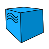
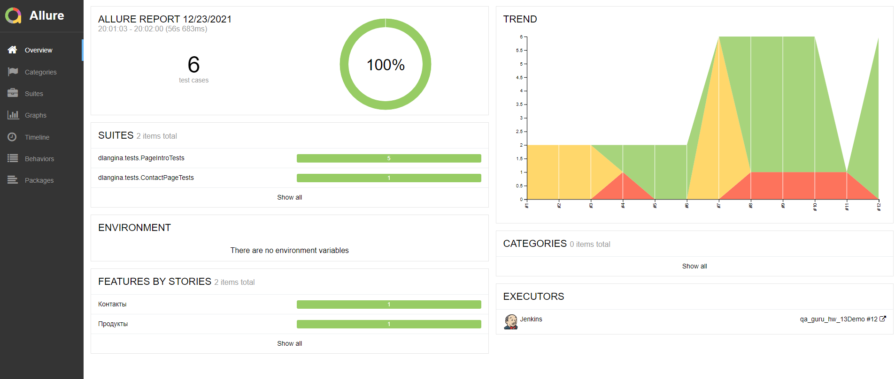
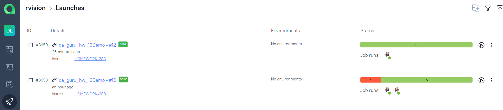
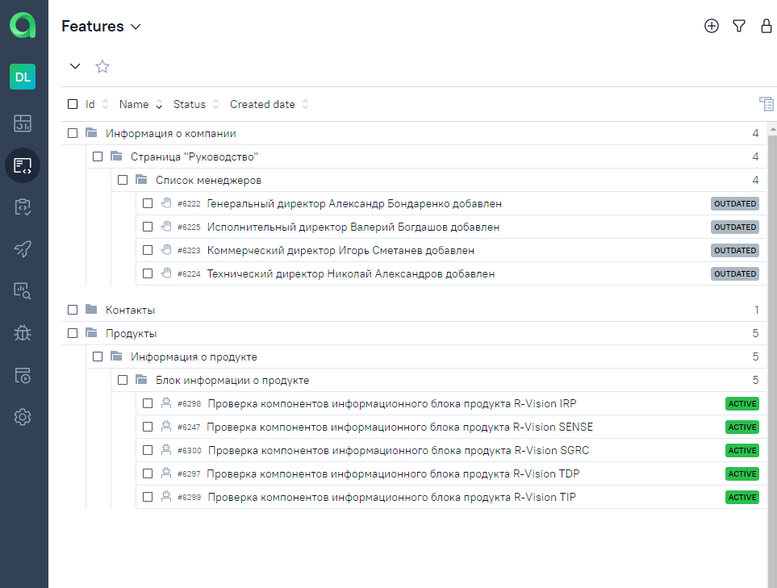
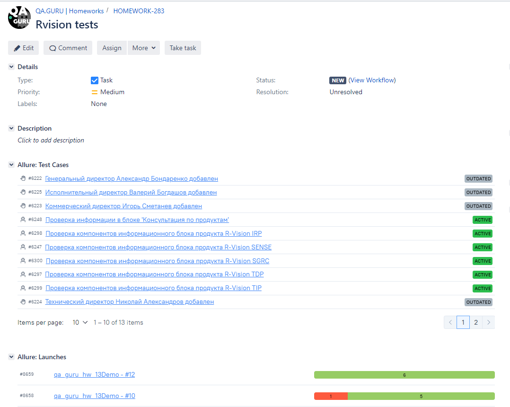
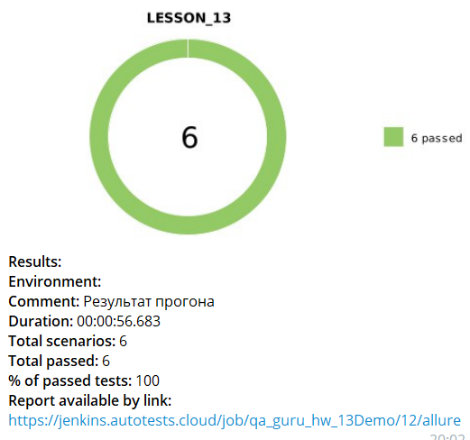
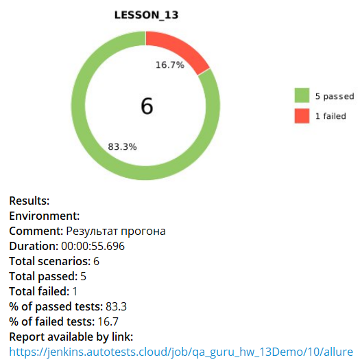
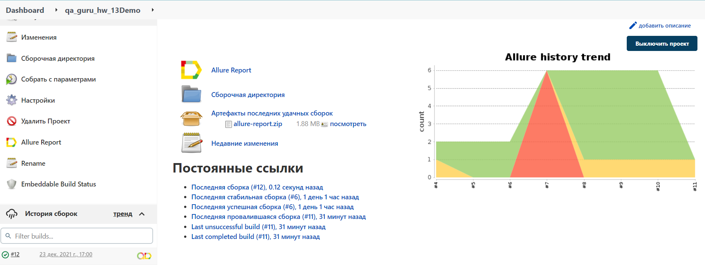
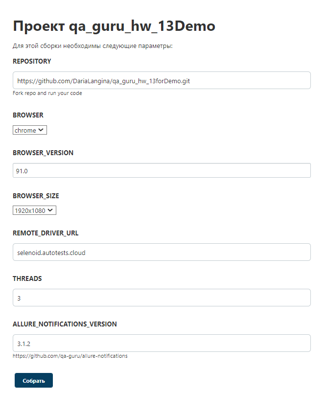

<h1 align="center"> :robot: Проект по автоматизации тестирования в рамках обучения на курсе QA.GURU </h1>

## :rocket: Технологический стек

IntelliJ IDEA, Java, Gradle, JUnit5, Selenide, Selenoid, Jenkins, Allure Report, Allure TestOps,
Jira, Github, Telegram

<p  align="center"

<code></code>
<code></code>
<code></code>
<code></code>
<code></code>
<code></code>
<code></code>
<code></code>
<code></code>
<code></code>
<code></code>
<code></code>
</p>

## UI тесты

* ✅ Проверка компонентов информационного блока продукта R‑Vision IRP
* ✅ Проверка компонентов информационного блока продукта R‑Vision SENSE
* ✅ Проверка компонентов информационного блока продукта R‑Vision SGRC
* ✅ Проверка компонентов информационного блока продукта R‑Vision TDP
* ✅ Проверка компонентов информационного блока продукта R‑Vision TIP

### Отчёт о прохождении автотестов в Allure Report

<p align="center">
  
</p>

### Хранение тестовой документации в Allure TestOps

<p align="center">
  
</p>

<p align="center">
  
</p>

### Интерграция с Jira

<p align="center">
  
</p>

### Пример запуска теста в Selenoid

<p  align="left"
<code></code>
</p>

### Уведомления о прохождении автотестов в Telegram

<p align="center">
  
</p>

<p align="center">
  
</p>

Serve report:

```bash
allure serve build/allure-results
```

### Запуск в Jenkins

Статистика по запускам <br >
<p align="center">
  
</p>

Параметры запуска <br >
<p align="center">
  
</p>

### Как запустить

Перед выполением необходимо:

* в local.properies определить параметры конфигурации (для запуска тестов локально)
* в remote.properies определить параметры конфигурации (для запуска тестов удаленно) или передать
  значения:

* browser (default chrome)
* browserVersion (default 89.0)
* browserSize (default 1920x1080)
* remoteDriverUrl (url address from selenoid or grid)
* threads (number of threads)

### Локально

```
gradle clean test
```

### Удаленно

```
gradle clean -DremoteDriverUrl=https://%s:%s@selenoid.autotests.cloud/wd/hub/ -Dthreads=1 test
```

:heart: <a target="_blank" href="https://qa.guru">qa.guru</a><br/>
:blue_heart: <a target="_blank" href="https://t.me/qa_automation">t.me/qa_automation</a>
